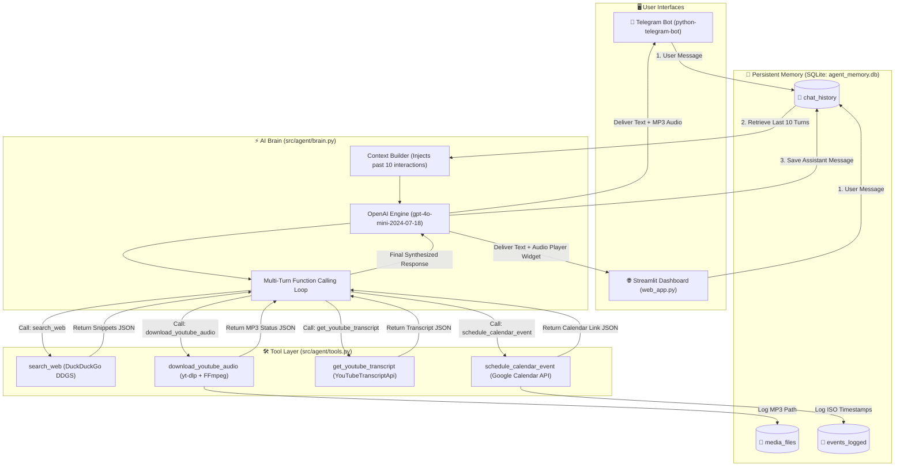

# ⚡ AutoMate: Multimodal Personal Executive AI Agent

AutoMate is an autonomous, multimodal personal executive agent built with **Python 3.14**, **OpenAI GPT-4o-mini**, **SQLite persistent memory**, and full multi-turn **function calling / tool routing**. It operates seamlessly across both a **Streamlit Web Dashboard** and an asynchronous **Telegram Bot**, providing executive-grade automation for web intelligence, audio extraction, video transcript summarization, and calendar scheduling.

---

## 📑 Table of Contents
1. [Key Features](#-key-features)
2. [System Architecture](#-system-architecture)
3. [APIs, SDKs & Connection Bridges](#-apis-sdks--connection-bridges)
4. [Project Structure](#-project-structure)
5. [Prerequisites & Environment Setup](#-prerequisites--environment-setup)
6. [How to Run the Interfaces](#-how-to-run-the-interfaces)
7. [Comprehensive Feature Testing Guide](#-comprehensive-feature-testing-guide)
8. [Database Schema](#-database-schema)

---

## 🌟 Key Features

* 🌐 **Real-Time Live Web Search & News Synthesis**: Powered by DuckDuckGo with automated query normalization and multi-source news aggregation for up-to-the-minute facts and citations.
* 🎧 **High-Fidelity YouTube MP3 Audio Extraction**: Downloads YouTube audio using `yt-dlp` and transcodes it into pure 192kbps `.mp3` files via bundled static `ffmpeg`. Automatically delivered as a playable audio track in Telegram mobile and Streamlit.
* 📝 **YouTube Closed-Caption Transcript Extraction**: Extracts full closed-caption transcripts from YouTube videos using `youtube-transcript-api` and synthesizes executive takeaways.
* 📅 **Google Calendar OAuth2 Scheduling**: Direct integration with Google Calendar API v3 using OAuth2 tokens and intelligent natural-language-to-ISO-8601 timestamp parsing.
* 🧠 **Persistent SQLite Long-Term Memory**: Relational memory stored in `agent_memory.db` with B-Tree indexes. Retains chat turns, tracks downloaded media assets, and logs scheduled appointments across session restarts.

---

## 🏛️ System Architecture



---

## 🔌 APIs, SDKs & Connection Bridges

| Component | Library / SDK | Target Model / API | Function / Bridge Description |
| :--- | :--- | :--- | :--- |
| **Agent Brain** | `openai` (v3.x) | `gpt-4o-mini-2024-07-18` | Central reasoning core. Executes multi-turn tool calling, context synthesis, and decision routing. |
| **Telegram Interface** | `python-telegram-bot` (v22.x) | Telegram Bot API | Asynchronous long-polling listener. Receives text commands and pushes native audio player files. |
| **Web Interface** | `streamlit` (v1.6x) | Browser HTML5 UI | Responsive executive dashboard with conversation streams, live audio players, and sidebar task feeds. |
| **Web Search** | `duckduckgo-search` / `ddgs` | DuckDuckGo Text & News API | Real-time live web browsing without API keys. Provides search snippets and source citations. |
| **Audio Transcoder** | `yt-dlp` + `imageio-ffmpeg` | YouTube Media Streams | `android_vr` bypass extractor that streams and converts YouTube audio into 192kbps `.mp3` files. |
| **Transcript Engine**| `youtube-transcript-api` | YouTube Timed Text API | Extracts closed captions and timestamps from YouTube videos for executive briefings. |
| **Calendar Engine** | `google-api-python-client` | Google Calendar API v3 | OAuth2 (`InstalledAppFlow`) integration that books meetings and returns direct event links. |
| **Data Memory** | `sqlite3` | `agent_memory.db` | Indexed relational storage for multi-turn conversational recall, media logs, and calendar event history. |

---

## 📁 Project Structure

```text
AI-Agent/
├── .env                        # API keys and bot tokens
├── .gitattributes              # Git repository settings
├── agent_memory.db             # Persistent SQLite database (auto-generated)
├── credentials.json            # Google Calendar OAuth2 Client Secrets
├── token.json                  # Google Calendar Cached User Tokens (auto-generated)
├── pyproject.toml              # Dependencies and uv package metadata
├── README.md                   # Project documentation
│
├── downloads/                  # Local media storage
│   └── audio/                  # Extracted MP3 audio files
│
└── src/
    ├── agent/
    │   ├── __init__.py         # Agent exports
    │   ├── brain.py            # OpenAI LLM orchestration & tool calling loop
    │   └── tools.py            # Strictly typed tool implementations & docstrings
    │
    ├── data/
    │   ├── __init__.py         # Database exports
    │   └── database.py         # SQLite memory layer & indexed query helpers
    │
    └── interfaces/
        ├── __init__.py         # Interface exports
        ├── telegram_bot.py     # Asynchronous Telegram bot listener
        └── web_app.py          # Streamlit dashboard interface
```

---

## ⚙️ Prerequisites & Environment Setup

### 1. Clone & Navigate to Repository
```powershell
cd "c:\Users\DARSHAN TARWARE\OneDrive\Pictures\Documents\GitHub\AI-Agent"
```

### 2. Configure Environment Variables (`.env`)
Create or edit the `.env` file in the root directory:
```env
# Telegram Bot Token (obtained from @BotFather)
TELEGRAM_BOT_TOKEN="8683344387:AAGAgA8TGKmWvkhOFQHFRxCDZ1NCWpbKs_M"

# OpenAI API Key
OPEN_AI_API="sk-proj-your_openai_api_key_here"

# (Optional) Model override (defaults to gpt-4o-mini-2024-07-18)
OPENAI_MODEL="gpt-4o-mini-2024-07-18"
```

### 3. Google Calendar OAuth (`credentials.json`)
To enable live Google Calendar sync:
1. Go to [Google Cloud Console](https://console.cloud.google.com/).
2. Enable the **Google Calendar API**.
3. Create an **OAuth 2.0 Client ID (Desktop Application)** and download it as `credentials.json` in the root folder.
*(If omitted, calendar events will still be recorded locally in `agent_memory.db`).*

### 4. Activate the Virtual Environment
Using `uv`:
```powershell
# Windows PowerShell
.\.venv\Scripts\Activate.ps1

# Linux / macOS
source .venv/bin/activate
```
*(Or use `uv run <command>` without activating manually).*

---

## 🚀 How to Run the Interfaces

You can run either the **Streamlit Web App**, the **Telegram Bot**, or both concurrently in separate terminal windows:

### Option A: Launch Streamlit Dashboard
```powershell
uv run streamlit run src/interfaces/web_app.py
```
> The dashboard will automatically launch in your browser at `http://localhost:8501`.

### Option B: Start Telegram Bot Listener
```powershell
uv run python src/interfaces/telegram_bot.py
```
> The bot will begin polling Telegram servers. Open your Telegram app, search for your bot, and send `/start`.

---

## 🧪 Comprehensive Feature Testing Guide

Test all 5 core agent capabilities with these copy-paste prompts:

### 1. Live Web Search & News Briefing
> **Prompt:**
> ```text
> Search the web for the latest advancements in quantum computing in 2026.
> ```
* **Verification:** AutoMate executes `search_web`, fetches live DuckDuckGo text/news feeds, and replies with structured bullet points and clickable source citations.

---

### 2. Pure MP3 YouTube Audio Download & Media Routing
> **Prompt:**
> ```text
> Download the audio from https://youtu.be/Eo-KmOd3i7s
> ```
* **Verification on Telegram:** AutoMate uploads the converted **192kbps `.mp3`** file directly to the chat with a native mobile player (supporting background audio playback and play/pause controls).
* **Verification on Streamlit:** The audio widget and a **⬇️ Download button** render immediately in the chat stream and under **"🎧 Downloaded Media"** in the sidebar.

---

### 3. Closed-Caption YouTube Video Summarization
> **Prompt:**
> ```text
> Get the transcript of https://www.youtube.com/watch?v=dQw4w9WgXcQ and give me a 3-bullet summary of the theme.
> ```
* **Verification:** AutoMate calls `get_youtube_transcript` to extract closed captions and returns an executive breakdown.

---

### 4. Live Google Calendar Event Booking
> **Prompt:**
> ```text
> Schedule an executive sync titled "AutoMate Architecture Review" on 2026-08-25 from 2:00 PM to 3:00 PM.
> ```
* **Verification:** AutoMate converts the natural language date into ISO-8601 (`2026-08-25T14:00:00`), books the meeting to your Google Calendar, returns a clickable event link, and logs the appointment to the database.

---

### 5. Multi-Turn Persistent Context Recall
> **Turn 1:**
> ```text
> Remember that my primary development focus is building autonomous agent workflows in Python.
> ```
> *(Close the browser or restart the bot)*
> 
> **Turn 2:**
> ```text
> What is my primary development focus based on our previous discussions?
> ```
* **Verification:** AutoMate queries `agent_memory.db` via `get_chat_history()`, prepends previous turns to the system prompt, and accurately recalls your preferences.

---

## 🗄️ Database Schema (`agent_memory.db`)

```sql
-- 1. Conversational History
CREATE TABLE chat_history (
    id INTEGER PRIMARY KEY AUTOINCREMENT,
    user_id TEXT NOT NULL,
    role TEXT NOT NULL,
    message TEXT NOT NULL,
    timestamp TIMESTAMP DEFAULT CURRENT_TIMESTAMP
);
CREATE INDEX idx_chat_user_time ON chat_history (user_id, timestamp DESC);

-- 2. Downloaded Media Registry
CREATE TABLE media_files (
    id INTEGER PRIMARY KEY AUTOINCREMENT,
    user_id TEXT NOT NULL,
    file_path TEXT NOT NULL,
    file_type TEXT NOT NULL DEFAULT 'audio',
    timestamp TIMESTAMP DEFAULT CURRENT_TIMESTAMP
);
CREATE INDEX idx_media_user_time ON media_files (user_id, timestamp DESC);

-- 3. Scheduled Calendar Events
CREATE TABLE events_logged (
    id INTEGER PRIMARY KEY AUTOINCREMENT,
    user_id TEXT NOT NULL,
    summary TEXT NOT NULL,
    start_time TEXT NOT NULL,
    end_time TEXT NOT NULL,
    timestamp TIMESTAMP DEFAULT CURRENT_TIMESTAMP
);
CREATE INDEX idx_events_user ON events_logged (user_id, timestamp DESC);
```

---

## 👨‍💻 Author & Maintenance
* **Developer**: Darshan Tarware
* **Project**: AutoMate Executive Agent
* **Runtime**: Python 3.14 / uv / OpenAI GPT-4o-mini
